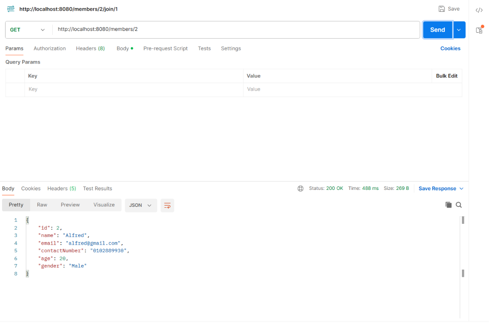

# HNGOUT — Event-Sharing Platform API

A RESTful backend for an event-sharing platform where organizers can create events, members can join events, and members can review events they have joined.

Built with Spring Boot, Spring Data JPA, Maven, and MySQL.

## Features

* **User roles** — Members and organizers are modelled using JPA inheritance.
* **Event management** — Organizers can create events and users can view available events.
* **Event joining** — Members can join events using a many-to-many relationship.
* **Reviews** — Members can review events only after joining them, enforced through service-layer business logic.
* **Layered architecture** — Controllers handle API requests, services handle business rules, and repositories handle database access.

## Tech Stack

* Java 21
* Spring Boot 3.x
* Spring Web
* Spring Data JPA
* MySQL
* Maven
* Lombok

## Design Highlights

* **JPA inheritance** — `User` is an abstract base entity, with `Member` and `Organizer` extending it.
* **Many-to-many relationship** — Members and events are connected through a join table.
* **Review validation** — The review service checks whether a member has joined an event before allowing the member to create a review.
* **RESTful API structure** — Endpoints are organized by members, organizers, events, and reviews.

## API Endpoints

| Method | Endpoint                                       | Description                |
| ------ | ---------------------------------------------- | -------------------------- |
| POST   | `/organizers`                                  | Create an organizer        |
| POST   | `/members`                                     | Create a member            |
| GET    | `/members`                                     | List all members           |
| GET    | `/members/{memberId}`                          | Get a member by ID         |
| PUT    | `/members/{memberId}`                          | Update a member            |
| DELETE | `/members/{memberId}`                          | Delete a member            |
| POST   | `/events/{organizerId}`                        | Organizer creates an event |
| GET    | `/events`                                      | List all events            |
| POST   | `/members/{memberId}/join/{eventId}`           | Member joins an event      |
| POST   | `/reviews/members/{memberId}/events/{eventId}` | Member reviews an event    |
| GET    | `/reviews/events/{eventId}`                    | View reviews for an event  |

## Running Locally

1. Create a MySQL database named `hngout`.
2. Copy `application.properties.example` to `application.properties`.
3. Fill in your local MySQL username and password.
4. Run the application:

```bash
mvn spring-boot:run
```

5. The API will be available at:

```text
http://localhost:8080
```
## API Screenshots
### DTO response hides password

This endpoint returns member data without exposing the password field.


